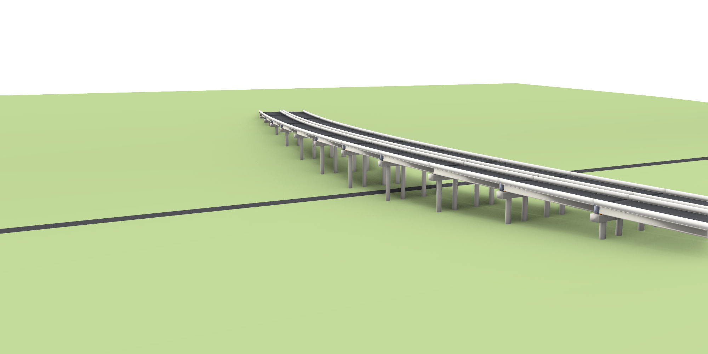
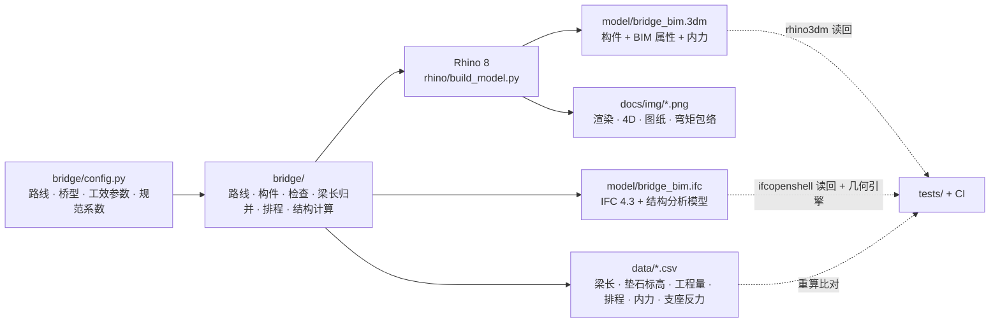
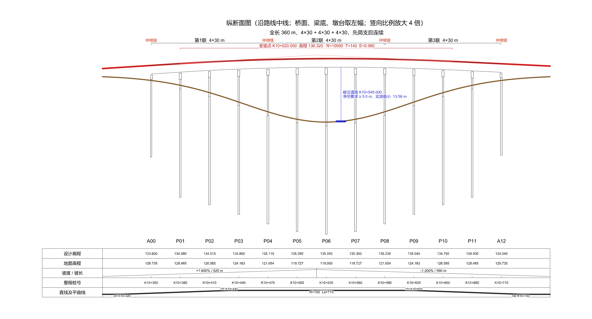
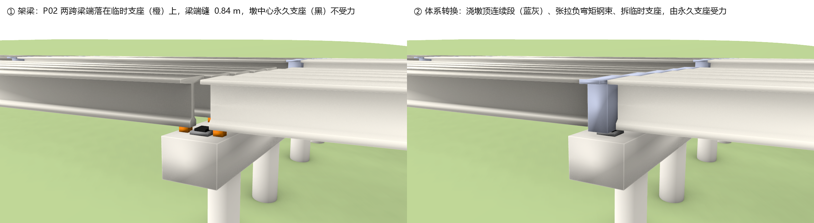
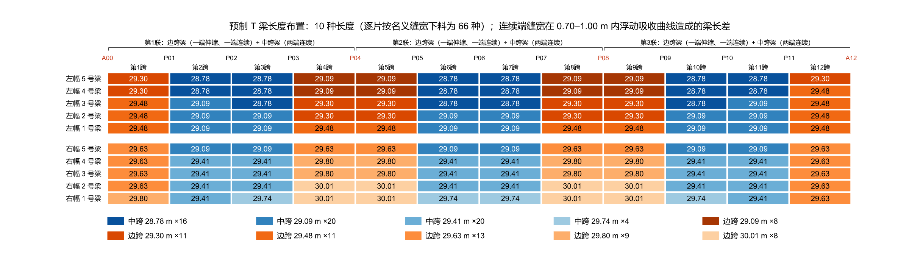
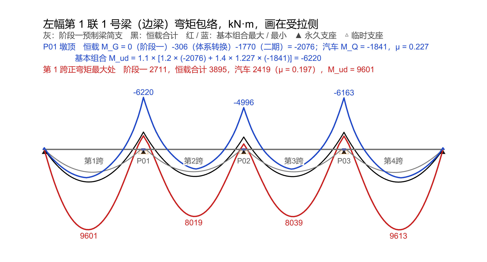
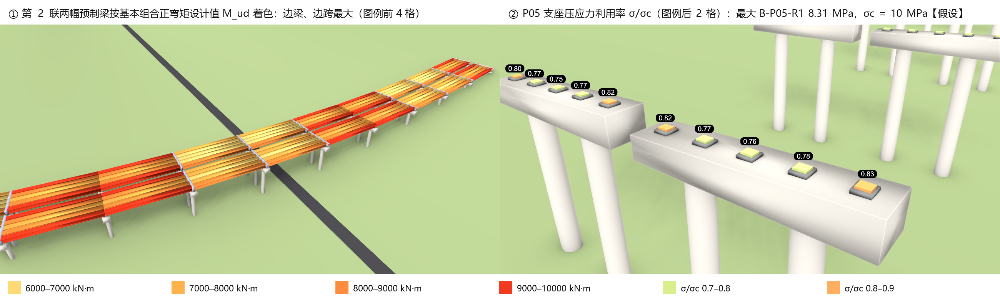
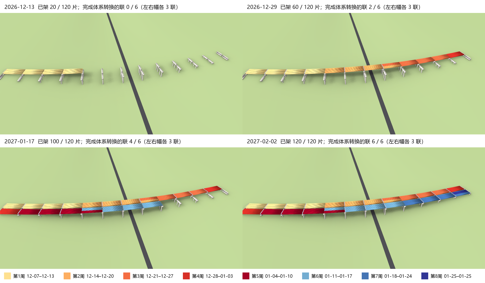
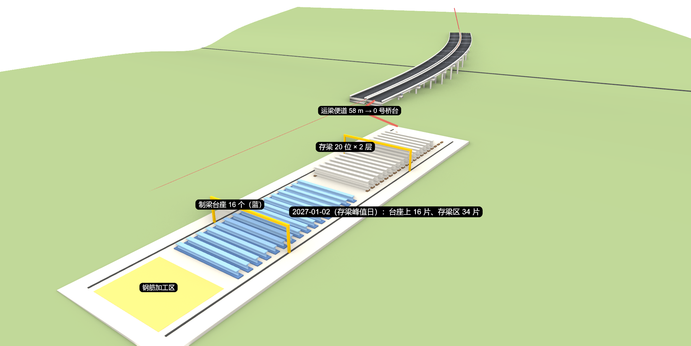
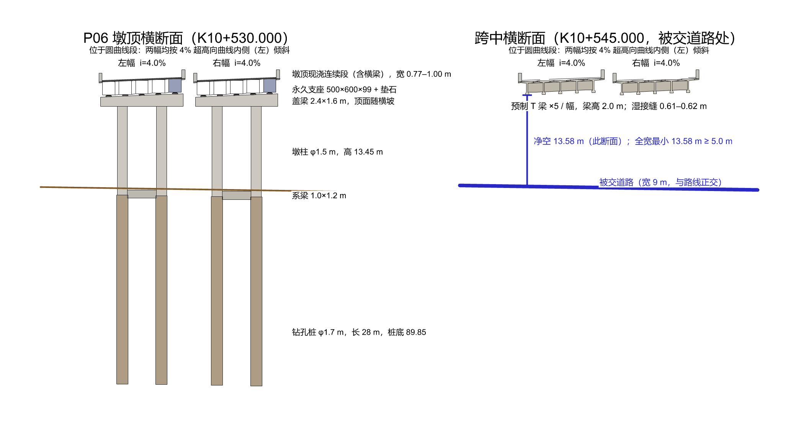

# bridge-bim · 曲线 T 梁桥 BIM

[](https://github.com/LUOaini1213/bridge-bim/actions/workflows/ci.yml)

**A curved precast-T-girder highway bridge modelled from its alignment up, in Rhino 8 and IFC 4.3, with a
construction-stage structural analysis written back into the model.**
A 1110 m route (tangent – clothoid – circular arc – clothoid – tangent, with a parabolic crest curve and
superelevation) carries a 12-span, 3-unit continuous bridge: 1470 elements, 120 of them precast T-girders.
Girder lengths are equalised as an interval-stabbing problem — 10 lengths instead of 66, with an optimality
certificate. The superstructure is analysed stage by stage (simply supported girders, then continuity) under
dead load and the JTG D60-2015 lane load, by a standard-library stiffness solver that is cross-checked against
OpenSees; the results size the bearings and go back into the Rhino objects and into two IFC structural
analysis models. It is a teaching-level analysis — no prestressing, reinforcement or section-capacity design.
27 design, construction and structural checks all pass, and each is proven to fail on a deliberately
broken model. The precast yard and the erector are scheduled together in 4D and exported with the model
to IFC 4.3 (IfcAlignment + IfcBridge + IfcWorkSchedule + IfcStructuralAnalysisModel), schema-valid and
byte-reproducible. CI re-derives every number in this README from the committed `.3dm`, IFC and CSV files.



## 一眼看懂

- 路线 **1110** m：直线 – 回旋线 – 圆曲线 R=**700** m – 回旋线 – 直线，竖曲线 R=**10000** m，圆曲线段超高 **4%**
- 桥梁 **K10+350.000 – K10+710.000**，**12**×30 m 分 **3** 联、先简支后连续，左右两幅；共 **1470** 个构件，其中预制 T 梁 **120** 片
- 预制梁长：逐片按名义缝宽下料要 **66** 种长度，归并后 **10** 种（中跨 **4** + 边跨 **6**），并给出「不可能更少」的证书
- 上部结构计算：一期恒载由简支的预制梁承担，体系转换后二期恒载与公路-I级车道荷载由连续梁承担；
  30 条梁位线里基本组合正弯矩最大 **9941.9** kN·m、墩顶负弯矩最大 **-6377.2** kN·m，活载长期挠度最大为限值的 **0.234**；
  支座按压应力选型（伸缩端 φ450、连续墩 500×600），利用率最大 **0.831**；自写求解器与 OpenSees 互核到 1e-9
- 检查：模型 17 条 + 梁场与架梁 5 条 + 上部结构 5 条，**27/27** 通过；每条都有一个故意弄坏的反例，证明它会变红
- 4D：梁场 **16** 个台座提前 **21** 天开工，架桥机 **50** 天架完 120 片、**0** 天等梁；存梁峰值 **34** 片（容量 **40**）；**2027-02-02** 完成全部体系转换
- IFC 4.3：**100,168** 个实体，schema 校验 **0** 个问题；几何引擎逐件算出实体，体积与位置和模型一致到 1e-6
- 下文每个数字都由 `scripts/check_readme.py` 对着已提交的产物回算，CI 每次提交都跑

路线、地形、桥梁都是虚构的示例；尺寸、工效、设备能力这些不是物理常数的参数集中在
[`bridge/config.py`](bridge/config.py)，逐项标着【几何】或【假设】。改那里、重跑，下面的表全部跟着变。

## 一个模型，多份产物



构件几何只算一次（[`bridge/model.py`](bridge/model.py)），Rhino 脚本和 IFC 导出读的是同一份顶点与参数；
`.3dm` 由 rhino3dm 读回、IFC 由 ifcopenshell 的几何引擎重新算成实体，各自和模型逐件对照。
IFC 不从 `.3dm` 反读，因为路线的语义定义（线元类型、半径、回旋线参数、竖曲线）在 Rhino 的网格里已经不存在了。

## 路线：平、纵、横

| 线元 | 起点桩号 | 长度 (m) | 曲率 |
|---|---|---|---|
| 直线 | K10+000.000 | 320 | 0 |
| 回旋线 | K10+320.000 | 110 | 0 → 1/700 |
| 圆曲线 | K10+430.000 | 190 | 1/700 |
| 回旋线 | K10+620.000 | 110 | 1/700 → 0 |
| 直线 | K10+730.000 | 380 | 0 |

回旋线没有解析解：平面坐标用分段 5 点 Gauss–Legendre 积分方位角得到，再拿测量上的级数公式
（x = l − l⁵/40A⁴ + …，y = l³/6A² − …）独立算一遍，两者差 < 1e-9 m；导出的 IfcGradientCurve 交给
ifcopenshell 的几何内核求值，是第三种算法，与自己的积分在平面上差 < 1e-5 m、高程上差 < 1e-6 m。

纵断面：变坡点 K10+520.000，高程 136.320，前坡 +1.600%、后坡 -1.200%，抛物线竖曲线 L=280 m
（R=10000，T=140，E=0.980）。横坡：直线段各幅 2% 向外侧排水，圆曲线段两幅都 4% 超高向曲线内侧，
在回旋线上线性过渡；每幅绕自己的中心线旋转。



## 结构体系：先简支后连续

12 跨分 3 联（4×30 + 4×30 + 4×30）。13 条支承线分三种：2 个桥台、2 个过渡墩（两联交界，设伸缩缝）、
9 个连续墩。

- **伸缩端**（桥台、过渡墩）：梁端面距支承线 0.04 m，联与联之间留 0.08 m 伸缩缝；梁直接落在 φ450×77 永久支座上，共 60 个。
- **连续端**（连续墩）：架梁时两跨梁端各落在一个临时支座上，共 180 个；墩中心一排 500×600×99 矩形永久支座（90 个，
  顺桥向 500 mm）整个落在两梁端之间的缝下，体系转换前不接触预制梁。浇墩顶现浇连续段、张拉负弯矩钢束后拆临时支座，
  由永久支座受力。连续段宽 0.708–0.998 m，由梁长归并决定（见下节）。支座规格由压应力验算定（见「上部结构计算」）。
- 梁端面平行于径向支承线（曲线上最大斜角 1.228°），所以同一条缝在梁宽范围内等宽；
  盖梁、台帽顶面按该处桥面横坡做成斜面，垫石高 0.150–0.156 m。
- 每跨相邻两片梁之间 5 道横隔板（两道端横隔板 + 1/4、1/2、3/4 跨），沿径向、腹板面到腹板面：
  这是荷载横向分布用修正偏心压力法的前提（桥上有可靠的横向联结）。



## 梁长归并：66 种 → 10 种

直梁放在曲线上：每片梁搁在两条径向支承线之间、同一偏距处两点连成的三维弦上，曲线外侧的弦比内侧长，
左右两幅、每跨、每个梁位都不一样。逐片按名义缝宽（伸缩端 0.04 m、连续端 0.425 m）下料取整到 10 mm，
要 **66** 种梁长——66 种端模设置。

但连续端的缝宽可以在 0.35–0.50 m 之间浮动（连续段宽 0.70–1.00 m），伸缩端不动。于是每片梁的可行长度是
一个区间，问题变成「用最少的长度刺穿全部区间」。这是区间刺穿：按右端点排序，遇到还没被刺穿的区间就在它的
右端点放一个点——贪心的结果可证最优。程序同时输出**证书**：一组两两不相交的区间，个数等于所选长度数，
任何方案都至少要这么多种。中跨梁（两端连续）与边跨梁（一端伸缩）的端部构造不同，分开归并：

| 梁型 | 长度 (m) | 片数 |
|---|---|---|
| 中跨 | 28.78 | 16 |
| 中跨 | 29.09 | 20 |
| 中跨 | 29.41 | 20 |
| 中跨 | 29.74 | 4 |
| 边跨 | 29.09 | 8 |
| 边跨 | 29.30 | 11 |
| 边跨 | 29.48 | 11 |
| 边跨 | 29.63 | 13 |
| 边跨 | 29.80 | 9 |
| 边跨 | 30.01 | 8 |

允许的缝宽浮动越大，需要的长度越少——这是现浇工作量与预制规格之间的取舍：

| 连续端浮动 | 连续段宽 (m) | 中跨 | 边跨 | 合计 |
|---|---|---|---|---|
| ±0.005 | 0.84–0.86 | 34 | 26 | 60 |
| ±0.020 | 0.81–0.89 | 10 | 16 | 26 |
| ±0.040 | 0.77–0.93 | 6 | 11 | 17 |
| ±0.060 | 0.73–0.97 | 4 | 7 | 11 |
| ±0.075 | 0.70–1.00 | 4 | 6 | 10 |
| ±0.100 | 0.65–1.05 | 3 | 5 | 8 |
| ±0.125 | 0.60–1.10 | 2 | 4 | 6 |
| ±0.150 | 0.55–1.15 | 2 | 4 | 6 |



## 构件与检查

| 类别 | 数量 |
|---|---|
| 预制 T 梁 | 120 |
| 横隔板 | 480 |
| 湿接缝 | 96 |
| 翼缘现浇段 | 48 |
| 墩顶现浇连续段 | 18 |
| 桥面铺装 | 24 |
| 混凝土护栏 | 48 |
| 伸缩装置 | 8 |
| 支座垫石 | 150 |
| 板式橡胶支座 | 150 |
| 临时支座 | 180 |
| 盖梁 | 22 |
| 桥台台帽 | 4 |
| 桥台背墙 | 4 |
| 墩柱 | 44 |
| 系梁 | 22 |
| 钻孔灌注桩 | 52 |

铺装、护栏、翼缘现浇段沿路线每 1.5 m 取样，外缘跟随曲线（直梁「以直代曲」，曲线由现浇部分吸收）；
每个多面体都闭合、法向朝外，共 1382 个实体。检查直接在生成出的几何上量，不信任「按构造应当成立」：

| 检查 | 结果 | 实测 |
|---|---|---|
| 平曲线线元衔接：位置、方位角、曲率连续 | ✅ | 4 处衔接，最大位置差 < 1e-09 m，方位角差 < 1e-09 rad，曲率差 < 1e-12 |
| 竖曲线起终点：高程与纵坡连续 | ✅ | 2 处，最大高程差 < 1e-09 m，坡度差 < 1e-09 |
| 跨径 = 30 m（沿中线逐跨量） | ✅ | 12 跨，最大偏差 < 1e-09 m |
| 伸缩端梁端距支承线 = 0.04 m（端面与支承线平行） | ✅ | 60 个梁端 × 12 个端面顶点，最大偏差 < 1e-09 m |
| 连续墩现浇连续段宽 0.70 – 1.00 m | ✅ | 90 处，0.708 – 0.998 m，梁端面不平行度 < 1e-09 m |
| 湿接缝宽 ≥ 0.45 m（翼缘边缘实测） | ✅ | 量了 192 处，0.600 – 0.623 m |
| 支座垫石高 0.15 – 0.40 m | ✅ | 150 个垫石，0.150 m（S-L01-5a）– 0.156 m（S-L05-5a） |
| 垫石、临时支座落在盖梁 / 台帽顶面内 | ✅ | 最小边距 0.150 m（TS-R01-2b） |
| 临时支座高 ≥ 0.10 m | ✅ | 180 个，0.235 m（TS-R01-2b）– 0.263 m（TS-R02-1a） |
| 临时支座与永久支座垫石平面净距 ≥ 0.05 m | ✅ | 最小 0.100 m（TS-R10-1a） |
| 连续墩永久支座全在现浇连续段下（距预制梁端 ≥ 0.05 m） | ✅ | 最小 0.100 m（B-P09-R1） |
| 墩盖梁底高出地面（桥台埋入路堤，不在此列） | ✅ | 最小 1.29 m（CAP-P01-L） |
| 被交道路净空 ≥ 5.0 m | ✅ | 最小 13.58 m（G-L07-5 梁底） |
| 墩柱外缘距被交道路边线 ≥ 1.0 m | ✅ | 最小 9.54 m（C-P06-L2） |
| 最重预制梁 ≤ 架桥机额定 120 t | ✅ | G-R08-1 65.2 t，利用率 54% |
| 多面体闭合、法向朝外 | ✅ | 1382 个实体，不合格 0 个 |
| 预制梁长规格数达到下界（区间刺穿最优性证书） | ✅ | 中跨 4 种、边跨 6 种；实际梁长与规格最大差 < 1e-09 m，越出可行区间 0 片 |
| 存梁峰值 ≤ 存梁容量（20 个台座 × 2 层） | ✅ | 容量 40 片，峰值 34 片（2027-01-02） |
| 存梁期 ≤ 90 天 | ✅ | 最长 15 天 |
| 架设时龄期 ≥ 14 天 | ✅ | 最短 18 天 |
| 龙门吊抬吊能力 ≥ 最重预制梁 | ✅ | 2 台 × 50 t × 0.8 = 80 t，最重梁 65.2 t |
| 梁场不占路基（距路线中线 ≥ 25 m） | ✅ | 梁场边缘距中线 38.0 m |

「全过」本身不是证据。[`tests/test_model.py`](tests/test_model.py) 给每条检查配了一个反例：把一片梁的
伸缩端挪 1 cm、把连续端往墩中心线伸 0.2 m、把永久支座往梁端下推 0.1 m、翻转一个面、把一片梁多切 5 cm……
每改一处，对应那一条必须变红。

## 支座垫石标高表

每个永久支座的平面坐标、支座顶、垫石顶、盖梁顶高程与垫石高，全表 150 行见
[`data/bearings.csv`](data/bearings.csv)；临时支座 180 行见 [`data/temp_supports.csv`](data/temp_supports.csv)。节选：

| 支座 | 类型 | 规格 | 墩台 | X | Y | 支座顶 | 垫石顶 | 盖梁顶 | 垫石高 |
|---|---|---|---|---|---|---|---|---|---|
| B-L01-1a | 伸缩端 | φ450×77 | A00 | 302.3540 | 177.0626 | 131.5313 | 131.4543 | 131.3037 | 0.1507 |
| B-L01-2a | 伸缩端 | φ450×77 | A00 | 301.1167 | 179.1772 | 131.4688 | 131.3918 | 131.2413 | 0.1505 |
| B-P01-L1 | 连续墩 | 500×600×99 | P01 | 327.7582 | 192.2012 | 132.0311 | 131.9321 | 131.7821 | 0.1500 |

## 工程量

| 构件 | 数量 | 混凝土 (m³) | 强度等级 | 钢筋 (t) |
|---|---|---|---|---|
| 预制 T 梁 | 120 | 2943.55 | C50 | 559.27 |
| 横隔板 | 480 | 303.21 | C50 | 45.48 |
| 湿接缝 | 96 | 270.56 | C50 | 48.70 |
| 翼缘现浇段 | 48 | 124.22 | C50 | 22.36 |
| 墩顶现浇连续段 | 18 | 353.65 | C50 | 77.80 |
| 桥面铺装 | 24 | 1690.58 | C40+沥青 | 0.00 |
| 混凝土护栏 | 48 | 935.37 | C30 | 102.89 |
| 支座垫石 | 150 | 13.11 | C50 | 1.31 |
| 盖梁 | 22 | 1030.66 | C40 | 164.90 |
| 桥台台帽 | 4 | 111.26 | C40 | 16.69 |
| 桥台背墙 | 4 | 59.10 | C30 | 7.09 |
| 墩柱 | 44 | 637.89 | C40 | 89.31 |
| 系梁 | 22 | 113.52 | C30 | 13.62 |
| 钻孔灌注桩 | 52 | 3079.14 | C30 | 292.52 |
| 结构混凝土合计（不含铺装） | 1108 | 9975.24 |  | 1441.95 |

混凝土量是每个实体的精确体积（散度定理，对 IFC 几何引擎算出的体积核过）；钢筋按各类构件的
kg/m³ 指标估算【假设】，不是配筋计算的结果。

## 上部结构计算（教学级）

[`bridge/structure.py`](bridge/structure.py) 在同一份构件上算上部结构：截面、荷载、支座位置都从 BIM 构件取，
结果写回 `.3dm` 的构件属性和 IFC 的结构分析模型。只用标准库——平面梁单元直接刚度法、带状 Cholesky 分解、
子空间迭代求频率都是自己写的——所以 Rhino 8 里的 Python 3.9 也能直接跑；测试里再用 OpenSees 逐项互核。
这是教学级的内力估算，不是设计：没有预应力钢束，不验算截面应力与承载力，不计收缩徐变与温度梯度。
每个规范系数的出处写在 [`bridge/config.py`](bridge/config.py)，没核到原文的标【假设】。

施工阶段（先简支后连续）：

1. **一期恒载**（预制梁 + 横隔板 + 湿接缝 + 翼缘现浇段，构件体积 × 26 kN/m³）由每片预制梁承担：它两端落在永久支座
   （伸缩端）或临时支座（连续端）上，是简支梁。横隔板作为集中力放在它与梁轴的交点，每道一半给两侧的梁。
2. **体系转换**：浇墩顶连续段（混凝土直接浇在永久支座上【假设】）、拆除临时支座——等于把临时支座在阶段一的反力
   反向加到以永久支座为支承的整联连续梁上。
3. **二期恒载**（铺装 + 护栏，每跨五片梁均分）与**汽车荷载**作用在连续梁上。

全桥一期恒载 94680 kN、二期 65739 kN、连续段 9195 kN；每条梁位线每个阶段的支座反力与荷载平衡，
荷载合计与构件体积 × 容重对账，差都 < 1e-9。

汽车荷载按公路-I级车道荷载：qk = 10.5 kN/m，Pk = 2(L0 + 130) = 318.98–321.01 kN（取该联最大计算跨径【假设】）。
逐节点求影响线，均布荷载布满同号区段、集中荷载放在最大竖标处，剪力与支座反力的 Pk 乘 1.2。
荷载横向分布：跨中用修正偏心压力法（抗扭修正 β = 0.9310），支点用杠杆原理法，1–3 列车逐一枚举并乘横向车道布载系数；
弯矩全跨用 mc，剪力与反力的 m 从支点的 m0 线性过渡到 1/4 跨的 mc。冲击系数按每条梁位线整联连续梁的竖弯基频：
f1 = 3.201–3.459 Hz，μ = 0.1899–0.2036；负弯矩改用第二阶频率求 μ（偏安全）【假设】。

| 梁位 | 组合截面 I (m⁴) | mc | mc（不计抗扭，β = 1） | m0 |
|---|---|---|---|---|
| 1 / 5 号（边梁） | 0.46662 | 0.8541 | 0.8873 | 0.9918 |
| 2 / 4 号 | 0.45330 | 0.6126 | 0.6286 | 0.8673 |
| 3 号 | 0.45330 | 0.4626 | 0.4626 | 0.8673 |

组合：基本组合 γ0(γG·G + 1.4(1 + μ)Q)，γ0 = 1.1，结构重力有利时 γG 取 1.0；频遇组合 G + 0.7Q。
左幅第 1 联 1 号梁（边梁）按施工阶段拆开的弯矩（kN·m；全表 210 行见 [`data/sections.csv`](data/sections.csv)）：

| 截面 | 阶段一 | 体系转换 | 二期恒载 | 恒载合计 | 汽车 | μ | 基本组合 |
|---|---|---|---|---|---|---|---|
| 第 1 跨正弯矩最大处 | 2711.3 | 4.4 | 1179.0 | 3894.7 | 2419.4 | 0.1972 | 9601.4 |
| P01 墩顶 | 0.0 | -305.6 | -1770.2 | -2075.8 | -1841.3 | 0.2272 | -6219.8 |
| 第 2 跨正弯矩最大处 | 2671.5 | 2.2 | 561.1 | 3234.8 | 2033.3 | 0.1972 | 8018.5 |
| P02 墩顶 | 0.0 | -298.6 | -1189.3 | -1487.9 | -1604.3 | 0.2272 | -4995.9 |

墩顶没有一期恒载弯矩：预制梁在临时支座上简支时，墩顶还没连起来；连续后它只从体系转换里得到一小部分负弯矩，
主要的负弯矩来自二期恒载和汽车荷载。



支座选型：Rck（结构重力与汽车荷载标准值的组合，计冲击）/ Ae（加劲钢板面积）≤ σc。伸缩端 Rck 最大 1242.9 kN、
需要直径 0.408 m，取 φ450；连续墩 Rck 最大 2403.4 kN，圆形要 φ563，按 50 mm 进级是 φ600——可连续端梁端离墩中心线
最近只有 0.35 m，φ600 的边缘离梁端只剩 0.05 m，正好卡在检查下限上。所以用矩形 500 × 600（顺桥向 × 横桥向），
顺桥向离梁端 0.100 m。σc = 10 MPa 是【假设】：
JTG 3362-2018 第 8.7.3 条规定 Ae ≥ Rck/σc，σc 按 JT/T 4 取用，本仓没核 JT/T 4 原文。

| 检查 | 结果 | 实测 |
|---|---|---|
| 横向分布方法的前提：宽跨比 ≤ 0.5，每跨每对相邻梁在 1/4、1/2、3/4 跨有横隔板 | ✅ | B/l = 12.75/28.08 = 0.454；96/96 对梁间都有，位置最大偏差 < 1e-06 跨 |
| 荷载与反力平衡、荷载与构件体积对账 | ✅ | 30 条梁位线 × 3 个阶段，反力与荷载最大相对差 < 1e-09；一期 94680 kN、二期 65739 kN、连续段 9195 kN，与构件体积 × 容重相差 < 1e-09 |
| 汽车荷载长期挠度 ≤ L/600 | ✅ | 最大 11.7 mm / 限值 50.2 mm = 0.23（R 幅第 8 跨 1 号梁） |
| 支座平均压应力 ≤ 10 MPa | ✅ | 150 个永久支座，最大 8.31 MPa = 0.83 σc（B-P05-R1，Rck 2403 kN） |
| 基本组合下支座不脱空 | ✅ | 最小 496 kN（B-L09-5a：恒载 597 kN，汽车最小 -60 kN） |

结构检查同样先证明会失败：[`tests/test_structure.py`](tests/test_structure.py) 给每条配了反例——把一道横隔板挪 3 m、
漏算每跨一道横隔板、连续段混凝土算两遍、把挠度刚度 0.95EcI 改成 0.05EcI、在 BIM 里把一个支座顺桥向改成 300 mm、
把容重改成 0.3 kN/m³ 让桥面「失重」——对应那一条必须变红。求解器本身先对闭式解（简支、外伸、两跨与四跨等跨
连续梁的弯矩与反力，简支梁与两跨连续梁的频率），再在 OpenSees 里把同一条梁位线建一遍（elasticBeamColumn、
beamUniform / beamPoint 荷载、一致质量），节点位移、弯矩、反力、影响线竖标与前两阶频率逐项差 < 1e-9（相对）；
[`scripts/mutation_drill.py`](scripts/mutation_drill.py) 对求解器做 7 种变异（刚度矩阵一个元素 ×1.001、一致质量系数写错、
单元内集中力的固端力左右对调、漏掉集中力 Pk……），每种都有测试失败。



结果回到模型里：120 片预制梁和 330 个支座（永久 150 + 临时 180）在 `.3dm` 的 UserText 与 IFC 的属性集
BridgeBIM_Structural 里带着内力设计值、挠度、反力与压应力；逐片、逐个的数在
[`data/girder_forces.csv`](data/girder_forces.csv) 与 [`data/bearing_reactions.csv`](data/bearing_reactions.csv)。

## 梁场与 4D

梁场设在 0 号桥台前的路基右侧：16 个制梁台座、20 个存梁位 × 2 层、两台 50 t 龙门吊抬吊、钢筋加工区，
运梁便道 58 m 接到 0 号桥台。每个台座 7 天一个周期，开浇满 14 天才能架设；架桥机每天 10 个有效工时，
每片梁 2 小时、每跨架完过孔 6 小时，左幅架完转场 4 天再架右幅。

按这些规则，梁场 **2026-11-16** 开浇，架桥机 **2026-12-07** 开架、**2027-01-25** 架完，历时 **50** 天，
等于「梁全部备齐时」架桥机本身的极限工期 50 天——**0** 天等梁。存梁峰值 **34** 片（**2027-01-02**），
最长存梁 15 天，架设时最短龄期 18 天。

台座数与提前量互相牵制：台座少，架桥机就要停下来等梁；提前开工太多，存梁又放不下。扫一遍
（节选；「可行」= 存梁峰值不超过 40 片、存梁期不超过 90 天）：

| 台座 | 提前 (天) | 架梁 (天) | 等梁 (天) | 存梁峰值 | 最长存梁 (天) | 可行 |
|---|---|---|---|---|---|---|
| 12 | 14 | 70 | 20 | 19 | 11 | 是 |
| 12 | 21 | 63 | 13 | 24 | 14 | 是 |
| 12 | 28 | 56 | 6 | 36 | 21 | 是 |
| 14 | 14 | 60 | 10 | 22 | 11 | 是 |
| 14 | 21 | 53 | 3 | 28 | 14 | 是 |
| 14 | 28 | 50 | 0 | 42 | 21 | 否 |
| 16 | 14 | 53 | 3 | 25 | 11 | 是 |
| 16 | 21 | 50 | 0 | 34 | 15 | 是 |
| 16 | 28 | 50 | 0 | 50 | 22 | 否 |
| 18 | 14 | 50 | 0 | 28 | 11 | 是 |
| 18 | 21 | 50 | 0 | 46 | 18 | 否 |
| 18 | 28 | 50 | 0 | 60 | 25 | 否 |

零等梁又放得下的方案里台座最少的是 **16** 个、提前 **21** 天——就是采用的方案；14 个台座怎么调提前量都做不到
两全。全表在 [`data/sensitivity.csv`](data/sensitivity.csv)。

每幅每联最后一片梁架完的第二天浇墩顶连续段，7 天后张拉负弯矩钢束、拆临时支座：

| 幅 | 联 | 跨 | 连续墩 | 架完 | 浇连续段 | 体系转换 |
|---|---|---|---|---|---|---|
| 左幅 | 第1联 | 1–4 | P01 P02 P03 | 2026-12-13 | 2026-12-14 | 2026-12-21 |
| 左幅 | 第2联 | 5–8 | P05 P06 P07 | 2026-12-21 | 2026-12-22 | 2026-12-29 |
| 左幅 | 第3联 | 9–12 | P09 P10 P11 | 2026-12-29 | 2026-12-30 | 2027-01-06 |
| 右幅 | 第1联 | 1–4 | P01 P02 P03 | 2027-01-09 | 2027-01-10 | 2027-01-17 |
| 右幅 | 第2联 | 5–8 | P05 P06 P07 | 2027-01-17 | 2027-01-18 | 2027-01-25 |
| 右幅 | 第3联 | 9–12 | P09 P10 P11 | 2027-01-25 | 2027-01-26 | 2027-02-02 |





湿接缝、铺装、护栏不在这份计划里。

## 图纸

纵断面（上文）按模型的构件与路线函数绘制，附资料表（设计高程、地面高程、坡度坡长、里程桩号、直线及平曲线，
含 ZH / HY / YH / HZ 四个曲线主点）。下面两个横断面不是另画的：Rhino 里用竖直平面剖切模型的网格与 Brep，
截线平移到图纸位置、按构件类别填色。



## IFC 4.3

[`model/bridge_bim.ifc`](model/bridge_bim.ifc)（IFC4X3_ADD2）：

- **IfcAlignment**：水平与竖向两层语义定义（线元类型、长度、半径、坡度、竖曲线半径），配 IfcCompositeCurve /
  IfcGradientCurve 几何；13 条支承线各一个 IfcReferent（Pset_Stationing 记桩号）。
- **IfcBridge**（GIRDER）→ 上部结构 / 下部结构 → 左幅、右幅 → 第 1–3 联（DECK_SEGMENT）；桥台与墩（ABUTMENT / PIER）
  用 IfcLinearPlacement 按桩号定位在 IfcGradientCurve 上，共 23 个 IfcBridgePart。
- **预制 T 梁**：IfcBeam T_BEAM，T 形截面（IfcArbitraryClosedProfileDef）沿梁轴斜向拉伸，两端各用一个
  IfcBooleanClippingResult 按径向支承线切齐，共 240 个切割；其余多面体是 IfcPolygonalFaceSet（1262 个，
  与 Rhino 网格同一组顶点），墩柱、桩、支座、系梁是拉伸体。
- **属性与工程量**：每个构件带 BridgeBIM_Element（编号、所属联 / 墩台、梁长、端部类型、缝宽、预制与架设日期、
  支座顶与垫石高程……），标准的 Pset_BeamCommon、Pset_ConcreteElementGeneral、Pset_PrecastConcreteElementGeneral，
  以及按类别的 Qto_*BaseQuantities；标准工程量集里没有体积的类别，体积写进 Qto_BodyGeometryValidation。
- **4D**：IfcWorkPlan → IfcWorkSchedule 下 261 个 IfcTask（预制 120、架设 120、连续段浇筑与体系转换各 6，另有汇总任务），
  架设任务以 IfcRelAssignsToProduct 产出对应的梁，体系转换任务以 IfcRelAssignsToProcess 消耗（拆除）临时支座；
  251 条 IfcRelSequence 的时差都按两端任务的实际时刻算出。
- **结构分析**：两个 IfcStructuralAnalysisModel，按施工阶段分开。阶段一「预制梁简支」：360 根 IfcStructuralCurveMember
  （每片梁两端外伸段 + 支座间）、480 个 IfcStructuralPointConnection，其中 240 个带 IfcBoundaryNodeCondition
  （伸缩端永久支座与临时支座）。阶段二「体系转换后的连续梁」：360 根杆件（每条梁位线 12 段）、390 个节点，
  150 个永久支座为边界条件。荷载工况是一期恒载（DEAD_LOAD_G）、拆除临时支座（PROPPING，反力反向施加）与二期恒载
  （COMPLETION_G1），共 720 条线荷载（按水平投影长度）和 1140 个集中力；结果组是阶段一支座反力与永久支座反力
  标准值组合 Rck，共 390 个 IfcStructuralPointReaction。分析杆件、支承点用 IfcRelAssignsToProduct 挂到对应的梁、
  连续段和支座上。测试核对：杆件端点就是节点、边界条件只在支承处、荷载合计等于计算、反力逐个等于支座表、
  阶段一杆件落在梁轴线上。

| 构件 | IFC 实体 | PredefinedType | 个数 |
|---|---|---|---|
| 预制 T 梁 | IfcBeam | T_BEAM | 120 |
| 横隔板 | IfcBeam | DIAPHRAGM | 480 |
| 盖梁、台帽 | IfcBeam | PIERCAP | 26 |
| 支座垫石 | IfcBeam | HATSTONE | 150 |
| 墩顶连续段、系梁 | IfcBeam | USERDEFINED | 40 |
| 永久支座 | IfcBearing | ELASTOMERIC | 150 |
| 临时支座 | IfcBearing | USERDEFINED | 180 |
| 湿接缝、翼缘现浇段 | IfcSlab | USERDEFINED | 144 |
| 墩柱 | IfcColumn | PIERSTEM | 44 |
| 钻孔灌注桩 | IfcPile | BORED | 52 |
| 桥面铺装 | IfcCourse | PAVEMENT | 24 |
| 混凝土护栏 | IfcRailing | GUARDRAIL | 48 |
| 伸缩装置 | IfcDiscreteAccessory | EXPANSION_JOINT_DEVICE | 8 |
| 桥台背墙 | IfcWall | RETAININGWALL | 4 |

文件共 **100,168** 个实体，ifcopenshell 的 schema 校验 **0** 个问题。GlobalId 由名称经 uuid5 推出、文件头时间戳固定，
同一份模型每次导出逐字节相同；在另一台机器上重导时，数学库末位的差别只允许落在浮点数的 1e-9（相对）以内，
结构、编号、文字必须逐字相同（[`bridge/numcmp.py`](bridge/numcmp.py)）。交给几何引擎（OpenCascade）逐件算成实体后：
斜拉伸加两次布尔切割的 T 梁与多面体，体积和包围盒都与模型差 < 1e-6；圆柱被引擎离散成多边形，体积差 < 0.5%。

## 复现

```bash
python -m venv .venv
.venv/Scripts/pip install -r requirements.txt
python scripts/build_data.py              # 重算 data/（只用标准库）
python scripts/export_ifc.py              # 写 model/bridge_bim.ifc
python scripts/run_rhino.py               # 需要本机 Rhino 8：建模、出图、存 .3dm
python -m unittest tests.test_alignment tests.test_model tests.test_schedule tests.test_structure
python -m pytest tests                    # 全部测试（含与 OpenSees 互核）
python scripts/check_readme.py            # README 里的数字逐个回算
python scripts/tamper_drill.py            # 篡改演练：改一处产物，必须有检查变红
python scripts/mutation_drill.py          # 变异演练：把求解器改错一处，必须有测试失败
```

CI 跑两组：`bridge/` 只用标准库、兼容 Python 3.9（Rhino 8 内置的 CPython 就是 3.9，建模脚本 import 同一份代码），
先单独跑一遍不装任何依赖的测试；再装 ifcopenshell、rhino3dm 与 openseespy 跑全部 137 个测试、重导 IFC 比对、回算 README。
OpenSeesPy 只在测试里用，拿来互核自写的求解器（它的许可对研究、教学与内部使用免费）。
Rhino 那一步在本机跑，它的产物 `model/bridge_bim.3dm` 由 rhino3dm 独立读回来核。

## 仓库结构

| 路径 | 内容 |
|---|---|
| `bridge/config.py` | 全部参数，逐项标【几何】【物理】【假设】 |
| `bridge/alignment.py` | 平曲线积分、回旋线级数、竖曲线、超高、地面线 |
| `bridge/model.py` | 构件生成：分联、梁长归并（区间刺穿 + 证书）、T 梁斜切棱柱、现浇部分、下部结构 |
| `bridge/checks.py` | 17 条模型检查 |
| `bridge/schedule.py` / `bridge/yard.py` | 梁场预制、存梁、架梁、体系转换；梁场布置与 5 条检查 |
| `bridge/structure.py` | 上部结构计算：截面、横向分布、施工阶段、影响线加载、频率与冲击系数、组合、挠度与支座验算；5 条结构检查 |
| `bridge/pipeline.py` | 交付表：梁长、垫石标高、工程量、逐桩坐标、排程、敏感性、内力、支座反力 |
| `rhino/build_model.py` | Rhino 8 建模、剖切出横断面、弯矩包络图、按内力着色、出图 |
| `scripts/` | 数据重算、IFC 导出（含结构分析模型）、调起 Rhino、README 回算、篡改演练、变异演练 |
| `tests/` | 路线、模型与反例、排程、结构计算（闭式解、OpenSees 互核、反例）、产物互核、README |
| `data/` | 20 个表（CSV / JSON） |
| `model/` | `.3dm`、IFC、Rhino 构建日志 |

## 范围

这是 BIM 建模、施工组织与教学级结构计算的示例，不是桥梁设计：梁高、截面、桩长按公路预制 T 梁桥的常见量级取定值；
结构计算只到内力、挠度与支座压应力，没有预应力钢束、配筋、截面应力与承载力验算，也不计收缩徐变、温度梯度、
预应力次内力与支座沉降，作用组合里只有结构重力与汽车荷载；曲线梁的弯扭耦合不计，每条梁位线展开成直梁。
缝宽范围、垫石高度范围等规则是示例取值，不是规范条文。
桥面铺装按「设计路面以下 0.20 m」取底面，预制梁翼缘顶在横坡方向上与它几厘米的高差（由调平层吸收）没有建模。
